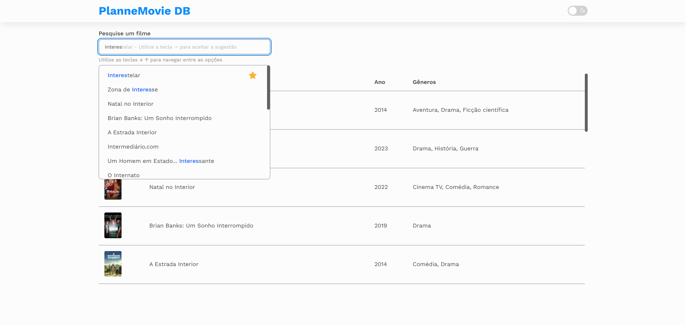

# 🎬 Planne - Movie Live Search

Aplicação desenvolvida como parte do teste técnico de front-end da [**Planne**](https://www.planne.com.br/).  
Permite pesquisar filmes utilizando a API do TMDb, favoritar resultados e acessar o link para o IMDB.

## 📸 Preview



## 🚀 Tecnologias utilizadas

- **React** + **Vite**
- **TypeScript**
- **CSS Modules**
- **Vitest** + **Testing Library**
- [**TMDB API**](https://developer.themoviedb.org/)
- **Docker + Docker Compose**
- **Makefile** para automação

## ⚙️ Como executar o projeto

### ✅ Pré-requisitos

- [Docker](https://www.docker.com/)
- [Docker Compose](https://docs.docker.com/compose/)
- [Token de leitura da API do TMDB (Token Bearer)](https://www.themoviedb.org/settings/api)

---

### 📦 Setup automatizado com Makefile

```bash
make setup TMDB_TOKEN=seu-token-aqui
```

Esse comando:

- Cria o arquivo `.env.local`
- Adiciona a chave da API do TMDb
- Executa o projeto com Docker

> Se não informar `TMDB_TOKEN`, será usado o valor padrão `seu-token-aqui`.

Para executar o projeto

```bash
make run
```

---

### 💡 Executando manualmente (sem Makefile)

#### 1. Criar o arquivo `.env.local`

```env
VITE_TMDB_API_URL=https://api.themoviedb.org/3
TMDB_TOKEN=seu-token-aqui
```

Substitua `seu-token-aqui` pela sua chave da API do TMDb.

---

#### 2. Executar com Docker

```bash
docker compose build
docker compose up
```

Acesse em: [http://localhost:5173](http://localhost:5173)

---

#### 3. Executar localmente (sem Docker)

Se você **já tem o `pnpm` instalado**:

```bash
pnpm install
pnpm dev
```

Se **não tem `pnpm`**, use:

```bash
corepack enable
corepack prepare pnpm@8.15.6 --activate
pnpm install
pnpm dev
```

## 🧪 Testes

Para rodar os testes unitários:

```bash
pnpm test:unit
```

Para visualizar a cobertura de testes:

```bash
pnpm test:coverage
```

## 👨‍💻 Autor

Desenvolvido com ❤️ por [Jonathan Pauluze](https://linkedin.com/in/jonathanpauluze)
